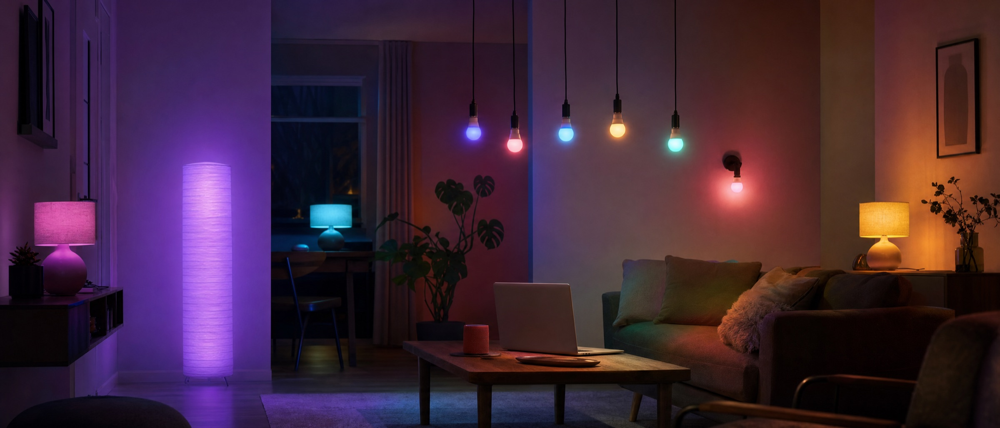
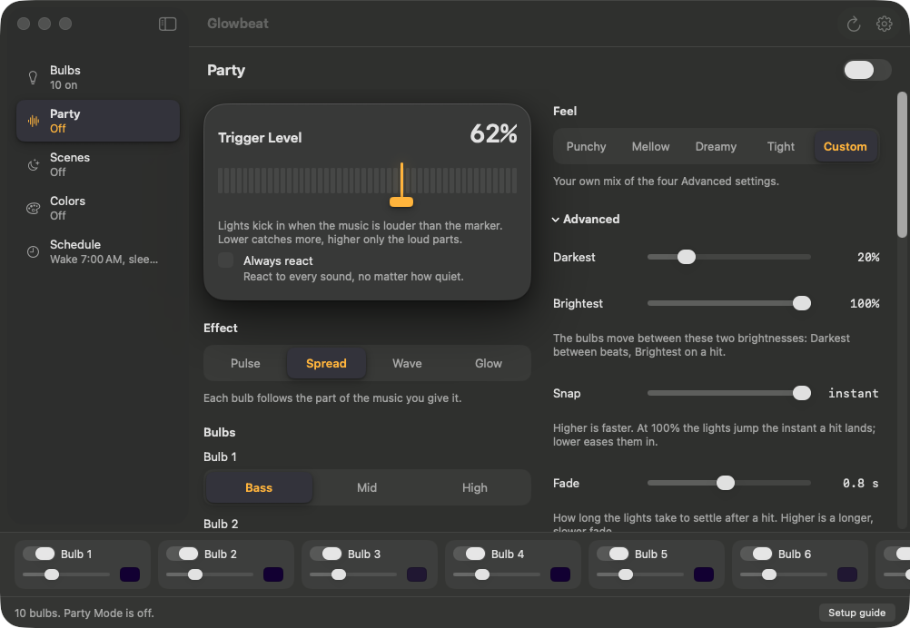
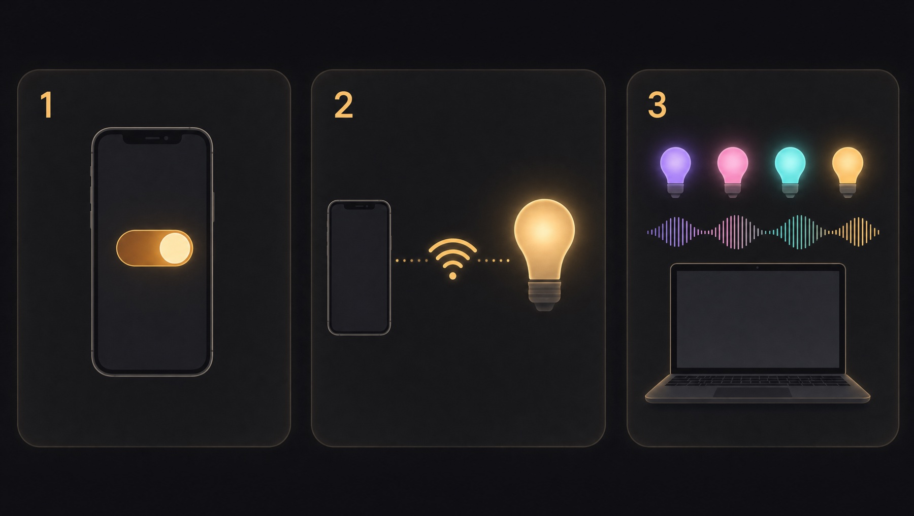

# Glowbeat



**Glowbeat turns your Govee smart bulbs into a light show for whatever your Mac is playing.**

I bought a 6 pack of Govee bulbs at Costco, and right away I wanted them to move with the music. So I built this.

It does the everyday stuff too. Pick a color. Have the lights wake you up in the morning. Then forget about it.

**Glowbeat is free and open source** (MIT license). No account, no cloud, no catch.

**[⬇ Download Glowbeat for Mac](https://github.com/fomoPhil/glowbeat/releases/latest/download/Glowbeat.dmg)** · free · macOS 14.4 or later

> **Which bulbs work?**
> Straight up: I've only tested Glowbeat with one kind of bulb. It's **the 6 pack from Costco** (Govee H6004 multicolor Wi-Fi bulbs), because that's what's in my living room.
> Other Govee lights might work. Nobody has tried them yet. If you try one, please [open an issue](https://github.com/fomoPhil/glowbeat/issues) and tell me how it went. "It worked" is just as useful as "it didn't."



---

## What it does

**🎵 Party**
Your bulbs react to anything playing on your Mac: Spotify, Apple Music, YouTube, a movie, anything.

- **Four styles:** Pulse (every bulb flashes together), Spread (each bulb follows bass, mid or high, and you pick which), Wave (color rolls from bulb to bulb), Glow (the room gets brighter when the music gets louder)
- **Ten color themes:** Party, Sunset, Ocean, Neon, Warm white, Blacklight, Forest, Candy, Ice and Fire
- **Confetti:** every bulb wears its own color, and no two neighbors ever match
- **Feel presets:** Punchy (fast and bright), Mellow (low and slow), Dreamy (soft hits, long settle) or Tight (sharp flicker, dark between hits). Sliders underneath if you want to fine-tune, and you can save your own mix as the default.
- **Trigger Level:** one marker sets how loud the music has to be before the lights react. Lower catches more. Or tick **Always react** and they'll move to everything.

Heads-up: Pulse with Punchy or Tight can flash fast. If flashing lights bother anyone in the room, try Glow or Dreamy.

**🎨 Colors**
26 hand-picked colors, one click each, from true daylight white to golden hour, dusk, blacklight and neon. Plus a brightness slider. Pick a color, pick a brightness, move on with your life.

**🌙 Scenes**
Calm, slow-moving light with no music needed: Breathe, Color flow, Candle, Sunset and Static.

**⏰ Schedule**
- **Wake:** the lights turn on at your wake-up time, fading up slowly if you like
- **Sleep:** they dim down and switch off at bedtime
- **Light mode:** Daylight (cool white), Night (warm, less blue light), or **Auto**, which follows your Mac's Night Shift

**💡 Bulbs**
Turn each bulb on or off, change its brightness and color, and give it a name. Drag the bulbs into the order they sit in your room. Not sure which is which? Click the ⚡ button and that bulb blinks.

**Menu bar:** the quick stuff lives up in your Mac's menu bar, so you don't need the window open.

**Private by design:** no account, no cloud, no analytics. Glowbeat talks to your bulbs directly over your home Wi-Fi. It hears your Mac's sound only to find the beat, and it never records or saves any of it.

---

## Getting started

Just bought the bulbs? Here's everything, start to finish.



### 1. Set up the bulbs in the Govee Home app (on your phone)

You only do this once.

1. Screw in the bulbs and switch them on.
2. Install **Govee Home** from the App Store or Google Play and sign in.
3. Tap **+** and add each bulb, following the app's steps. The bulbs need a **2.4 GHz** Wi-Fi network (most home routers have one).
4. **Turn on LAN Control for every bulb.** This is the step people miss, and Glowbeat can't see the bulbs without it:
   - Open a bulb in the Govee Home app
   - Tap the **gear icon** (Settings) in the top right corner
   - Switch **LAN Control** on
   - Repeat for each bulb

   Don't see LAN Control? Update the bulb from that same settings screen, then look again.

### 2. Put your Mac on the same Wi-Fi

Your Mac and the bulbs need to be on the **same home network.** Guest networks usually won't work, because they keep devices from seeing each other.

### 3. Open Glowbeat on your Mac

1. **[Download Glowbeat](https://github.com/fomoPhil/glowbeat/releases/latest/download/Glowbeat.dmg)**, open the file, and drag **Glowbeat** into your **Applications** folder.
2. Open it. It's signed and checked by Apple, so it opens like any other app.
3. When Glowbeat asks to **find devices on your local network**, click **Allow**.
4. Your bulbs show up in a few seconds. Click ⚡ on each one to see which bulb it is, then drag them into the order they sit in your room.

### 4. Start your first party

1. Click **Party** in the sidebar and flip the switch on.
2. Play some music.
3. The first time, macOS asks to let Glowbeat **hear your Mac's audio.** Click **Allow.** (It only listens to find the beat. Nothing is recorded or saved.)
4. Pick a style and a color theme, then drag the **Trigger Level** marker until it feels right. Lower reacts to more.

That's it. Enjoy the show.

---

## If something isn't working

| What you see | Try this |
|---|---|
| **No bulbs found** | Check that LAN Control is on for every bulb, and that your Mac is on the same Wi-Fi. Then look in **System Settings → Privacy & Security → Local Network** and make sure Glowbeat is switched on. |
| **Lights don't react to music** | Make sure something is playing and your Mac isn't muted. Check **System Settings → Privacy & Security → Screen & System Audio Recording** and switch Glowbeat on. Lower the Trigger Level, or tick **Always react.** |
| **Party paused by itself** | Someone changed a bulb in the Govee app, so Glowbeat stepped aside. Press **Resume.** |
| **The wake-up timer didn't turn the lights on** | Bulbs need power to wake up, so leave their wall switch on. Timers run while your Mac is awake; if it was asleep, the lights catch up when it wakes. |

Still stuck? Email me at woolley.pj@gmail.com, or see the [support page](https://philwoolley.com/glowbeat/support/).

---

## Want to help?

I'd love a hand. Here's what helps the most:

- **Try it with other Govee lights.** This is the big one. I only own the Costco bulbs. If you have a different Govee light, try Glowbeat and [open an issue](https://github.com/fomoPhil/glowbeat/issues) with the model number and what happened.
- **Report bugs and ideas.** Something weird happen? Wish it did something else? [Issues](https://github.com/fomoPhil/glowbeat/issues) is the place.
- **Send code.** Pull requests are welcome, especially ones that add support for more Govee lights. Fork it, poke at it, make it yours.

If Glowbeat made your room better, you can [buy me a coffee on Ko-fi](https://ko-fi.com/philwoolley). Totally optional, always appreciated.

Glowbeat is an independent app. It isn't made by, endorsed by, or affiliated with Govee.

---

## For developers

Glowbeat is a native macOS app written in Swift and SwiftUI. It needs **macOS 14.4 or later.**

```sh
brew install xcodegen
xcodegen generate
open Glowbeat.xcodeproj
```

Build and run the **Glowbeat** scheme. The design notes, research and test checklists live in `docs/`.

## License

MIT. See [LICENSE](LICENSE).
